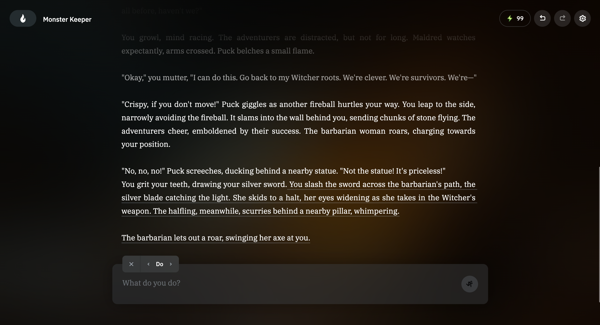

# PAC3 Manovich Reloaded

## Autor
**Nom:** Martí Serarols Tarrés 
**Curs:** Cultura Digital - Grau en Multimedia - UOC 
**Data:** 19/12/2024 

## Introducció
En aquest assaig, m'he proposat explorar dues maneres recents d'hibridar l'art digital que no es mencionen al llibre de Lev Manovich. Parlarem de com la Narrativa Digital Interactiva amb Intel·ligència Artificial i les Instal·lacions Artístiques Generatives amb Intel·ligència Artificial mostren com el programari i la tecnologia estan canviant la manera com fem art avui dia.

## Exemple 1: Narrativa Digital Interactiva amb Intel·ligència Artificial
### Descripció
La Narrativa Digital Interactiva fa servir intel·ligència artificial per crear històries que canvien segons les decisions dels usuaris. Amb eines com Twine i models de llenguatge com GPT-4, els creadors poden desenvolupar històries no lineals on cada elecció del lector pot influir en el final. Això crea una experiència única i personalitzada, on el lector pot interactuar directament amb la trama, els personatges i l'entorn de la història.

Un exemple genial d'aquesta combinació és el projecte AI Dungeon. Aquest projecte utilitza IA per generar aventures narratives infinites basades en les entrades dels jugadors. Això permet una flexibilitat creativa que supera els mètodes tradicionals de narració, incorporant elements que reaccionen en temps real a les accions dels usuaris.

### Anàlisi segons les Ulleres de Manovich
Des del punt de vista de Manovich, la Narrativa Digital Interactiva és una bona mostra de com la literatura tradicional es combina amb tecnologies de programari avançat. Aquesta fusió canvia dràsticament la manera com creem i consumim històries, fent que el programari sigui una eina clau en el procés creatiu. La capacitat de la IA per adaptar la història segons les interaccions dels usuaris mostra com diferents mitjans es converteixen en un sol mitjà, com descriu Manovich.

A més, aquesta forma d'art reflecteix la personalització i la interactivitat, elements molt importants en la societat digital d'avui. L'usuari ja no és només un lector passiu, sinó un participant actiu que influeix directament en el desenvolupament de la història. Això s'alinea perfectament amb les idees de Manovich sobre com el públic participa activament en la creació cultural digital.

### Recursos Multimèdia
- [AI Dungeon](https://play.aidungeon.io/)
- [Article sobre Narrativa Interactiva amb IA](https://vorecol.com/es/articulos/articulo-analisis-de-la-narrativa-generativa-en-la-creacion-de-experiencias-de-aprendizaje-inmersivas-mediante-ia-197117)
- [Vídeo demostratiu de AI Dungeon](https://www.youtube.com/watch?v=wUrwTYjFEmw)

## Exemple 2: Instal·lacions Artístiques Generatives amb Intel·ligència Artificial
### Descripció
Artistes com Refik Anadol fan servir algoritmes d'intel·ligència artificial per crear instal·lacions visuals que canvien en temps real basant-se en dades en directe. Aquestes instal·lacions combinen art visual amb programació avançada, oferint una experiència interactiva i en constant evolució. L'IA permet generar patrons visuals complexos que responen a coses com el clima, el moviment de les persones o altres dades en temps real, creant així obres d'art dinàmiques i adaptatives.

### Anàlisi segons les Ulleres de Manovich
Aquestes instal·lacions són un exemple clar de com l'art i el programari es fusionen, un tema que és central en l'obra de Manovich. Utilitzar IA per generar visuals en temps real mostra com el programari pot ser una eina creativa que amplia les possibilitats de l'expressió artística. A més, reflecteix la idea de la personalització i la interactivitat, que són molt importants en la nostra societat digital actual. Segons Manovich, el programari no només és una eina, sinó una part essencial de la creació cultural, i aquestes instal·lacions ho demostren perfectament.

### Recursos Multimèdia
- [Refik Anadol - Living Architecture Casa Batlló](https://refikanadol.com/works/living-architecture-casa-batllo/)
- [Vídeo de instal·lacions amb IA](https://www.youtube.com/watch?v=UxQDG6WQT5s)

### Conclusió
En resum, la Narrativa Digital Interactiva amb Intel·ligència Artificial i les Instal·lacions Artístiques Generatives amb Intel·ligència Artificial són dues maneres molt interessants en què el programari i la tecnologia estan canviant l'art digital. Aquestes novetats no només donen més eines creatives als artistes, sinó que també fan que les experiències siguin més immersives i interactives per a tothom que les gaudeix. Això mostra com el programari es converteix en una part essencial del procés creatiu, tal com ens explica Manovich. Aquestes innovacions reflecteixen perfectament com diferents mitjans es mesclen i com la tecnologia i la cultura interactuen constantment en el món d'avui.

### Referències i Bibliografia

1. **Manovich, Lev.** *(2013) El Software toma el mando. Barcelona: Editorial UOC.
2. **AI Dungeon.** [https://play.aidungeon.io/](https://play.aidungeon.io/)  
3. **Refik Anadol.** *Data Painting*. [https://refikanadol.com/works/data-painting/](https://refikanadol.com/works/data-painting/)  
4. **Vorecol.** *Narrativa Interactiva amb IA*. [https://vorecol.com/es/articulos/articulo-analisis-de-la-narrativa-generativa-en-la-creacion-de-experiencias-de-aprendizaje-inmersivas-mediante-ia-197117](https://vorecol.com/es/articulos/articulo-analisis-de-la-narrativa-generativa-en-la-creacion-de-experiencias-de-aprendizaje-inmersivas-mediante-ia-197117)  
5. **YouTube.** *Vídeo demostratiu de AI Dungeon*. [https://www.youtube.com/watch?v=wUrwTYjFEmw](https://www.youtube.com/watch?v=wUrwTYjFEmw)
6. **YouTube.** *Vídeo de instal·lacions amb IA*. [https://www.youtube.com/watch?v=UxQDG6WQT5s](https://www.youtube.com/watch?v=UxQDG6WQT5s)  
